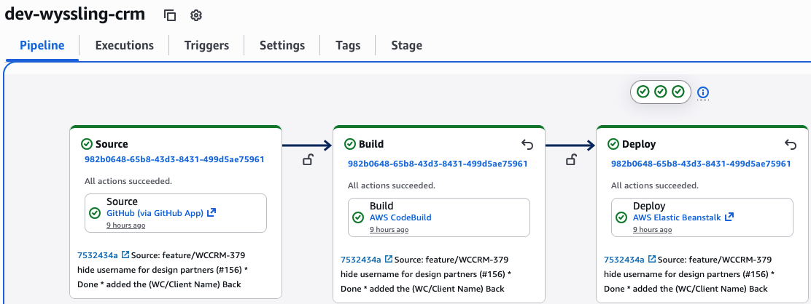
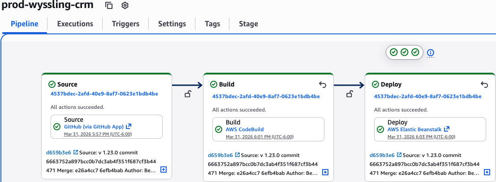
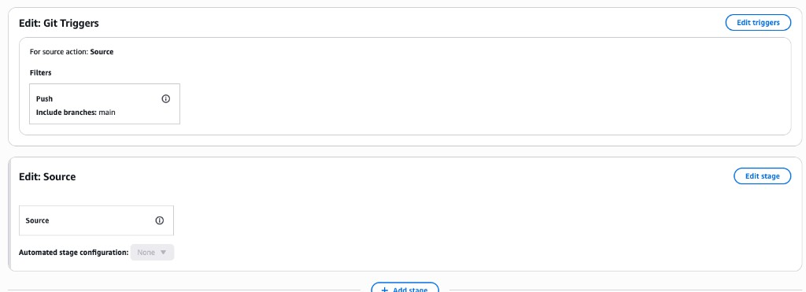
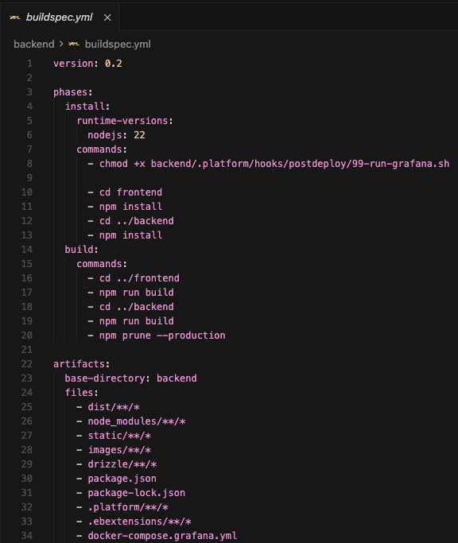

# Curiosity Report: AWS CodePipeline

## Why I chose this

At work we use **AWS CodePipeline** with **CodeBuild** and **Elastic Beanstalk**. I push code and the pipeline runs, but I didn’t really understand what was wired together or where the configuration lived. I wanted to learn how it’s set up and how it compares to the “push and things happen” workflows I’ve seen elsewhere.

## How we use Git with two pipelines

I branch off **`dev`**, do feature work, and open a **PR into `dev`**. Pushes on my **feature branch** run the **dev** pipeline; when the PR merges, **`dev`** gets another push and it runs again. **Production** uses a separate pipeline that runs on pushes to **`main`**. Sometimes I push to **`dev`** or **`main`** directly for small fixes. Having **dev** and **prod** pipelines keeps integration separate from what customers see.

## What I learned

### Pipeline vs CodeBuild

**CodePipeline** is the **orchestrator**: it defines an ordered list of **stages** (we use **Source → Build → Deploy**). Each stage has one or more **actions** (for example “get code from GitHub,” “run this CodeBuild project,” “deploy to this Elastic Beanstalk environment”). When a run starts, AWS gives it an **execution ID** so every stage in that run refers to the same commit.

**CodeBuild** is a **separate service** that actually runs commands on a build machine. The pipeline’s **Build** stage usually **invokes** CodeBuild; CodeBuild reads a **`buildspec.yml`** (or inline commands) to know what to install, build, and **package**. So the pretty diagram in CodePipeline is “what runs in what order,” and the buildspec is “the shell script shape of the middle step.”

### Artifacts and stage flow

Each stage can **output an artifact** (often a zip or folder tree stored in a pipeline artifact bucket). The **Source** stage hands off **whatever was in the repo at that commit**. The **Build** stage consumes that, runs the buildspec, and **produces** a new artifact—usually what we want Elastic Beanstalk to run. The **Deploy** stage takes that output and applies it to the EB environment. If something fails, only that stage shows red; earlier stages already finished, which makes debugging easier than one giant mystery log.

Between stages, the console shows whether the **transition** to the next stage is enabled (the lock/unlock idea). You could stop auto-deploys while still allowing builds by turning off a transition, though we mostly leave them open.

### Triggers and permissions

A run starts when our **Git trigger** fires (configured under **Edit pipeline → Git Triggers**). I originally looked in **EventBridge** and didn’t see obvious rules; for us, **Push** on **`main`** (prod) and the dev pipeline’s branch rules are enough. The **GitHub App** / connection is what lets AWS see pushes without me pasting tokens into the buildspec.

Behind the scenes, **CodePipeline** and **CodeBuild** use **IAM service roles** to read from S3, talk to EB, and so on. When a step fails with a vague “access denied” style error, the fix is often the role on that action, not my Git permissions.

### Screenshots from our setup

**Prod** is set to **Push** on **`main`** (see trigger screenshot). **Dev** is configured for our integration/feature branches. The pipeline views show **Source (GitHub) → CodeBuild → Elastic Beanstalk** for both environments.

### Buildspec

Our **`buildspec.yml`** lives under **`backend/`** (the CodeBuild project points at that path). It pins **Node 22**, installs **frontend** and **backend** dependencies, runs **`npm run build`** for both, then **`npm prune --production`** on the backend so the artifact isn’t full of dev-only packages. The **`artifacts`** section lists what gets zipped for the next stage: **`dist`**, production **`node_modules`**, **`.platform`** and **`.ebextensions`** for EB hooks/config, plus static assets. That matches how EB expects to receive a version of the app.

I’m not putting API keys or DB passwords in the buildspec—those stay in **Elastic Beanstalk environment properties**, **Systems Manager Parameter Store**, or **Secrets Manager**, and the running app reads them at runtime.

## Conclusion

I used to only watch the pipeline turn green. Now I can walk through a run: **Git trigger** → **Source** checkout → **CodeBuild** (driven by **buildspec**) → **artifact** → **Elastic Beanstalk** deploy, with **CodePipeline** coordinating stages and **IAM** granting access. Having **separate dev and prod pipelines** lines up with branching and keeps production tied to **`main`** on purpose.

## References

- [AWS CodePipeline documentation](https://docs.aws.amazon.com/codepipeline/latest/userguide/welcome.html)
- [CodeBuild buildspec reference](https://docs.aws.amazon.com/codebuild/latest/userguide/buildspec-ref.html)
