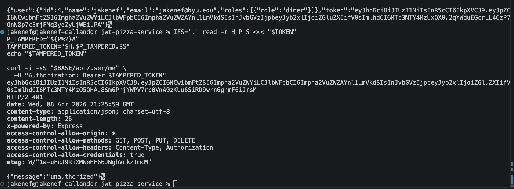
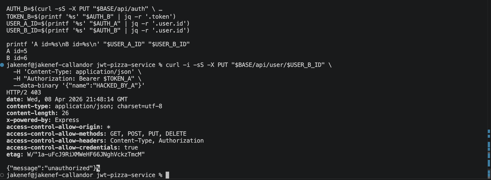
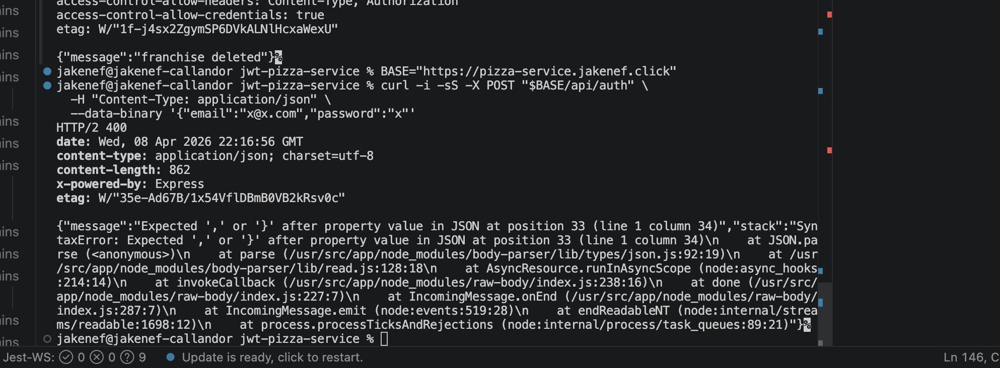

# Penetration testing report — JWT Pizza

**Peer 1:** Saam Naeini  
**Peer 2:** Jake Nef  

*Targets: `https://pizza-service.saamn.dev` (Saam) and `https://pizza-service.jakenef.click` (Jake). Frontends: `https://pizza.saamn.dev`, `https://pizza.jakenef.click`.*

**OWASP mapping:** Classifications below use **[OWASP Top 10:2025](https://owasp.org/Top10/2025/)** (e.g. **A01** Broken Access Control, **A07** Authentication Failures, **A02** Security Misconfiguration). Rows that are connectivity or methodology only are marked **N/A**.

---

## Self attack

### Peer 1 (Saam Naeini) — attacks on own deployment

#### Attack record 1 — Login / credential guessing

| Item | Result |
|------|--------|
| Date | 2026-04-09 |
| Target | `https://pizza-service.saamn.dev` |
| Classification | **A07:2025 – Authentication Failures** |
| Severity | 0 — Unsuccessful (no unauthorized access beyond testing a known admin email) |
| Description | Ran `PUT /api/auth` with `{"email":"a@jwt.com","password":...}` for several candidate passwords. Wrong passwords returned **HTTP 404**; correct password `admin` returned **HTTP 200** with a JWT. The API uses **404** for failed login (`unknown user`) instead of **401**, which can aid account enumeration. |
| Images | Terminal output from the password loop (`curl` status codes). |
| Corrections | N/A for this test. Optional: return **401** for invalid credentials and add login rate limiting. |

#### Attack record 2 — Diner access to admin user list

| Item | Result |
|------|--------|
| Date | 2026-04-09 |
| Target | `https://pizza-service.saamn.dev` |
| Classification | **A01:2025 – Broken Access Control** |
| Severity | 0 — Unsuccessful |
| Description | Authenticated as a **diner**, called `GET /api/user` with `Authorization: Bearer <diner JWT>`. Server returned **HTTP 403**; diner could not list all users. |
| Images | Optional — terminal showing **403** for `/api/user`. |
| Corrections | N/A |

#### Attack record 3 — Unauthenticated access to `/api/user/me`

| Item | Result |
|------|--------|
| Date | 2026-04-09 |
| Target | `https://pizza-service.saamn.dev` |
| Classification | **A07:2025 – Authentication Failures** |
| Severity | 0 — Unsuccessful |
| Description | `GET /api/user/me` with **no** `Authorization` header returned **HTTP 401**. |
| Images | Optional |
| Corrections | N/A |

#### Attack record 4 — Invalid Bearer token

| Item | Result |
|------|--------|
| Date | 2026-04-09 |
| Target | `https://pizza-service.saamn.dev` |
| Classification | **A07:2025 – Authentication Failures** |
| Severity | 0 — Unsuccessful |
| Description | `GET /api/user/me` with `Authorization: Bearer not-a-real-jwt` returned **HTTP 401**. |
| Images | Optional |
| Corrections | N/A |

#### Attack record 5 — Horizontal access control (update another user)

| Item | Result |
|------|--------|
| Date | 2026-04-09 |
| Target | `https://pizza-service.saamn.dev` |
| Classification | **A01:2025 – Broken Access Control** |
| Severity | 0 — Unsuccessful |
| Description | As a **diner**, sent `PUT /api/user/1` with JSON body attempting to change another user’s profile. Response **`{"message":"unauthorized"}`** with **HTTP 403**. |
| Images | Optional — terminal showing response body and **403**. |
| Corrections | N/A |

---

### Peer 2 (Jake Nef) — attacks on own deployment

*Narrative and commands merged from [jakenef/jwt-pizza-service `penTest/selfAttack.md`](https://github.com/jakenef/jwt-pizza-service/blob/main/penTest/selfAttack.md) ([`penTest` folder](https://github.com/jakenef/jwt-pizza-service/tree/main/penTest)). Put Jake’s screenshots in **this** folder next to `peerTest.md`: `unauthorizedJWTTamper.png`, `idorAttempt.png`, `franchiseDeleted.png`, `stackTrace.png`, `sqlInjection.png`.*

#### Attack record 1 — JWT tampering

| Item | Result |
|------|--------|
| Date | 2026-04-08 |
| Target | `https://pizza-service.jakenef.click` |
| Classification | **A07:2025 – Authentication Failures** |
| Severity | 0 — Unsuccessful |
| Description | Tampered with the JWT payload segment while reusing header/signature; `GET /api/user/me` correctly rejected the token (unauthorized). |
| Images |  |
| Corrections | N/A |

```bash
BASE="https://pizza-service.jakenef.click"
EMAIL="jakenef@byu.edu"
PASS="password"

AUTH_JSON=$(curl -sS -X PUT "$BASE/api/auth" \
  -H "Content-Type: application/json" \
  -d "{\"email\":\"$EMAIL\",\"password\":\"$PASS\"}")

TOKEN=$(printf '%s' "$AUTH_JSON" | jq -r '.token // empty')
IFS='.' read -r H P S <<< "$TOKEN"
P_TAMPERED="${P%?}A"
TAMPERED_TOKEN="$H.$P_TAMPERED.$S"

curl -i -sS "$BASE/api/user/me" \
  -H "Authorization: Bearer $TAMPERED_TOKEN"
```

#### Attack record 2 — Access another user’s profile (IDOR-style)

| Item | Result |
|------|--------|
| Date | 2026-04-08 |
| Target | `https://pizza-service.jakenef.click` |
| Classification | **A01:2025 – Broken Access Control** |
| Severity | 0 — Unsuccessful |
| Description | Registered diners **A** and **B**, then called `PUT /api/user/<B_id>` with **A**’s JWT. Server rejected the change (unauthorized). |
| Images |  |
| Corrections | N/A |

*Original notes used `pizza-service.saamn.dev` for the IDOR script; the table target above is Jake’s own API (`jakenef.click`).*

```bash
BASE="https://pizza-service.jakenef.click"
TS=$(date +%s)
EMAIL_A="idor_a_${TS}@byu.edu"
EMAIL_B="idor_b_${TS}@byu.edu"
PASS='Passw0rd123'

curl -sS -X POST "$BASE/api/auth" \
  -H 'Content-Type: application/json' \
  --data-binary "$(jq -nc --arg n 'IDOR A' --arg e "$EMAIL_A" --arg p "$PASS" '{name:$n,email:$e,password:$p}')" | jq

curl -sS -X POST "$BASE/api/auth" \
  -H 'Content-Type: application/json' \
  --data-binary "$(jq -nc --arg n 'IDOR B' --arg e "$EMAIL_B" --arg p "$PASS" '{name:$n,email:$e,password:$p}')" | jq

AUTH_A=$(curl -sS -X PUT "$BASE/api/auth" \
  -H 'Content-Type: application/json' \
  --data-binary "$(jq -nc --arg e "$EMAIL_A" --arg p "$PASS" '{email:$e,password:$p}')")

AUTH_B=$(curl -sS -X PUT "$BASE/api/auth" \
  -H 'Content-Type: application/json' \
  --data-binary "$(jq -nc --arg e "$EMAIL_B" --arg p "$PASS" '{email:$e,password:$p}')")

TOKEN_A=$(printf '%s' "$AUTH_A" | jq -r '.token')
USER_B_ID=$(printf '%s' "$AUTH_B" | jq -r '.user.id')

curl -i -sS -X PUT "$BASE/api/user/$USER_B_ID" \
  -H 'Content-Type: application/json' \
  -H "Authorization: Bearer $TOKEN_A" \
  --data-binary '{"name":"HACKED_BY_A"}'
```

#### Attack record 3 — Unauthenticated franchise deletion

| Item | Result |
|------|--------|
| Date | 2026-04-08 |
| Target | `https://pizza-service.jakenef.click` |
| Classification | **A01:2025 – Broken Access Control** |
| Severity | 3 — High (if unauthenticated delete succeeds on that build) |
| Description | `DELETE /api/franchise/:id` **without** `Authorization` succeeded on the tested code path (franchise removed). *After adding `authenticateToken` and an admin check, expect **401**/**403**.* |
| Images |  |
| Corrections | Require authentication and explicit authorization on franchise delete; regression test unauthenticated `DELETE`. |

*Partner’s raw notes used `BASE=https://pizza-service.saamn.dev` for one franchise-delete demo; self-attack target here is Jake’s service — align `BASE` with the environment you photographed.*

```bash
BASE="https://pizza-service.jakenef.click"
curl -sS "$BASE/api/franchise?page=0&limit=20" | jq
FRANCHISE_ID=1

curl -i -sS -X DELETE "$BASE/api/franchise/$FRANCHISE_ID"
curl -sS "$BASE/api/franchise?page=0&limit=20" | jq
```

#### Attack record 4 — Exposed implementation details (stack trace)

| Item | Result |
|------|--------|
| Date | 2026-04-08 |
| Target | `https://pizza-service.jakenef.click` |
| Classification | **A10:2025 – Mishandling of Exceptional Conditions** |
| Severity | 1 — Low |
| Description | Malformed JSON on `POST /api/auth` produced a response body leaking stack / implementation details. |
| Images |  |
| Corrections | Production-safe error messages; detailed errors only in server logs. |

```bash
BASE="https://pizza-service.jakenef.click"
curl -i -sS -X POST "$BASE/api/auth" \
  -H "Content-Type: application/json" \
  --data-binary '{"email":"x@x.com","password":"x"'
```

#### Attack record 5 — SQL error from profile update (injection surface)

| Item | Result |
|------|--------|
| Date | 2026-04-08 |
| Target | `https://pizza-service.jakenef.click` |
| Classification | **A05:2025 – Injection** |
| Severity | 2 — Medium |
| Description | `PUT /api/user/:id` with a **name** containing a single quote triggered a SQL syntax error in the response (unsafe string building in SQL). |
| Images |  |
| Corrections | Parameterize all SQL; never concatenate user input into query strings. |

```bash
BASE="https://pizza-service.jakenef.click"
TS=$(date +%s)
EMAIL="sqli_${TS}@byu.edu"
PASS="Passw0rd123"

REG=$(curl -sS -X POST "$BASE/api/auth" \
  -H "Content-Type: application/json" \
  --data-binary "$(jq -nc --arg n 'SQLI Test' --arg e "$EMAIL" --arg p "$PASS" '{name:$n,email:$e,password:$p}')")

TOKEN=$(printf '%s' "$REG" | jq -r '.token')
USER_ID=$(printf '%s' "$REG" | jq -r '.user.id')

curl -i -sS -X PUT "$BASE/api/user/$USER_ID" \
  -H "Content-Type: application/json" \
  -H "Authorization: Bearer $TOKEN" \
  --data-binary "$(jq -nc --arg n "x'" --arg e "$EMAIL" --arg p "$PASS" '{name:$n,email:$e,password:$p}')"
```

---

## Peer attack

### Peer 1 (Saam) attack on Peer 2 (Jake) — `https://pizza-service.jakenef.click`

#### Attack record 1 — Login / credential guessing

| Item | Result |
|------|--------|
| Date | 2026-04-09 |
| Target | `https://pizza-service.jakenef.click` |
| Classification | **A07:2025 – Authentication Failures** |
| Severity | 0 — Unsuccessful for wrong passwords; successful login only with correct secret |
| Description | `PUT /api/auth` with `a@jwt.com` and a small password list: wrong guesses returned **404**; password `admin` returned **200**. |
| Images | Terminal / Intruder-style output as captured during testing. |
| Corrections | Same as enumeration note above; rate limiting recommended. |

#### Attack record 2 — Empty password login bypass

| Item | Result |
|------|--------|
| Date | 2026-04-09 |
| Target | `https://pizza-service.jakenef.click` |
| Classification | **A07:2025 – Authentication Failures** |
| Severity | 3 — High (authentication bypass for known email) |
| Description | `PUT /api/auth` with `{"email":"a@jwt.com","password":""}` returned **HTTP 200** and issued a JWT, same class of issue as a falsy password skipping `bcrypt` verification in `getUser`. |
| Images | Terminal output showing **200** for empty password. |
| Corrections | Require non-empty password on login; always run `bcrypt.compare` for login; redeploy service. |

#### Attack record 3 — Diner calls admin user list

| Item | Result |
|------|--------|
| Date | 2026-04-09 |
| Target | `https://pizza-service.jakenef.click` |
| Classification | **A01:2025 – Broken Access Control** |
| Severity | 2 — Medium (authorization wrong on the endpoint; no user rows returned in this environment) |
| Description | With a **diner** JWT (registered on `https://pizza.jakenef.click`), `GET /api/user` returned **HTTP 200** and `{"users":[],"more":false}`. Follow-up: `GET` with `page=1&limit=500&name=*` and `jq` produced an empty `users` array; admin-role filter on `jq` had no matches; looping `page=1..5` with `limit=50` returned the same empty list each time. A diner should get **403** here—**200** is still a defect even when the list is empty. |
| Images | Terminal: status **200** for `/api/user`, `jq` output, and/or pagination loop. |
| Corrections | Enforce `Role.Admin` on `GET /api/user` before listing; add automated test with a diner token expecting **403**. |

#### Attack record 4 — Unauthenticated `/api/user/me`

| Item | Result |
|------|--------|
| Date | 2026-04-09 |
| Target | `https://pizza-service.jakenef.click` |
| Classification | **A07:2025 – Authentication Failures** |
| Severity | 0 — Unsuccessful |
| Description | `GET /api/user/me` without a token returned **HTTP 401**. |
| Images | Optional |
| Corrections | N/A |

#### Attack record 5 — Invalid Bearer token

| Item | Result |
|------|--------|
| Date | 2026-04-09 |
| Target | `https://pizza-service.jakenef.click` |
| Classification | **A07:2025 – Authentication Failures** |
| Severity | 0 — Unsuccessful |
| Description | `GET /api/user/me` with `Authorization: Bearer not-a-real-jwt` returned **HTTP 401**. |
| Images | Optional |
| Corrections | N/A |

#### Attack record 6 — Diner `PUT` another user

| Item | Result |
|------|--------|
| Date | 2026-04-09 |
| Target | `https://pizza-service.jakenef.click` |
| Classification | **A01:2025 – Broken Access Control** |
| Severity | 0 — Unsuccessful |
| Description | Diner `PUT /api/user/1` with JSON `{"name":"x","email":"x@test.com","password":"x"}` returned **`{"message":"unauthorized"}`** and **HTTP 403**. |
| Images | Optional |
| Corrections | N/A |

#### Attack record 7 — Unauthenticated franchise deletion

| Item | Result |
|------|--------|
| Date | 2026-04-09 |
| Target | `https://pizza-service.jakenef.click` |
| Classification | **A01:2025 – Broken Access Control** |
| Severity | 0 — Unsuccessful (endpoint behaved correctly) |
| Description | `DELETE /api/franchise/1` with **no** `Authorization` header returned **`{"message":"unauthorized"}`** and **HTTP 401**. Unauthenticated franchise wipe was not possible. |
| Images | Optional — terminal showing **401** and JSON body. |
| Corrections | N/A |

#### Attack record 8 — Authenticated diner `GET /api/user/me`

| Item | Result |
|------|--------|
| Date | 2026-04-09 |
| Target | `https://pizza-service.jakenef.click` |
| Classification | **A07:2025 – Authentication Failures** |
| Severity | 0 — Unsuccessful (expected success for valid session) |
| Description | Same **diner** JWT as in attack 3: `GET /api/user/me` returned **HTTP 200** (valid token accepted for that service’s login table). |
| Images | Optional |
| Corrections | N/A |

#### Attack record 9 — Public franchise listing (recon)

| Item | Result |
|------|--------|
| Date | 2026-04-09 |
| Target | `https://pizza-service.jakenef.click` |
| Classification | **A02:2025 – Security Misconfiguration** (anonymous data exposure / recon) |
| Severity | 0–1 — Unsuccessful to Low (by design in stock JWT Pizza) |
| Description | `GET /api/franchise?page=0&limit=10&name=*` **without** authentication returned **HTTP 200** and JSON listing franchises (e.g. **Provo** id 3, **SLC** id 2) and store stubs. Useful for mapping the tenant; not a critical flaw if intentional. |
| Images | Optional — `curl` JSON snippet. |
| Corrections | N/A unless product should hide franchise names from anonymous clients. |

---

### Peer 2 (Jake) attack on Peer 1 (Saam) — `https://pizza-service.saamn.dev`

*Merged from [Jake’s `penTest/selfAttack.md` — “Peer Attack (Jake attack Saam)”](https://github.com/jakenef/jwt-pizza-service/blob/main/penTest/selfAttack.md). Reuse the same image files in this folder if they document runs against Saam’s API.*

#### Attack record 1 — JWT tampering

| Item | Result |
|------|--------|
| Date | 2026-04-09 |
| Target | `https://pizza-service.saamn.dev` |
| Classification | **A07:2025 – Authentication Failures** |
| Severity | 0 — Unsuccessful |
| Description | Tampered JWT; `GET /api/user/me` correctly returned unauthorized. |
| Images | Optional (same technique as self-attack). |
| Corrections | N/A |

#### Attack record 2 — Access user B’s resources as user A (IDOR-style)

| Item | Result |
|------|--------|
| Date | 2026-04-09 |
| Target | `https://pizza-service.saamn.dev` |
| Classification | **A01:2025 – Broken Access Control** |
| Severity | 0 — Unsuccessful |
| Description | Attempted to change user **B**’s profile while authenticated as **A**; server rejected (no vulnerability found). |
| Images | Optional |
| Corrections | N/A |

#### Attack record 3 — Unauthenticated franchise deletion

| Item | Result |
|------|--------|
| Date | 2026-04-09 |
| Target | `https://pizza-service.saamn.dev` |
| Classification | **A01:2025 – Broken Access Control** |
| Severity | 3 — High (per partner reproduction: unauthenticated delete succeeded before Saam’s middleware fix) |
| Description | `DELETE /api/franchise/:id` without auth succeeded on the tested build (franchise removed). *If Saam’s deployed service now returns **401**/**403**, note that in class as remediation verified.* |
| Images |  |
| Corrections | Add `authenticateToken` + role check on franchise delete (Saam implemented this in `franchiseRouter.js`). |

#### Attack record 4 — Exposed implementation details (stack trace)

| Item | Result |
|------|--------|
| Date | 2026-04-09 |
| Target | `https://pizza-service.saamn.dev` |
| Classification | **A10:2025 – Mishandling of Exceptional Conditions** |
| Severity | 1 — Low |
| Description | Error responses exposed stack / implementation details (e.g. malformed JSON on auth). |
| Images |  |
| Corrections | Generic client errors in production; log internals server-side only. |

#### Attack record 5 — SQL error from profile update (injection surface)

| Item | Result |
|------|--------|
| Date | 2026-04-09 |
| Target | `https://pizza-service.saamn.dev` |
| Classification | **A05:2025 – Injection** |
| Severity | 2 — Medium |
| Description | Single-quote payload in **name** on `PUT /api/user/:id` produced SQL syntax error in response (unsafe query construction). |
| Images |  |
| Corrections | Parameterize SQL for `updateUser`; sanitize error responses. |

#### Supplement — Operator notes (Saam / Jake session)

| Item | Result |
|------|--------|
| Date | 2026-04-09 |
| Target | Mixed |
| Classification | **N/A** |
| Severity | 0 |
| Description | Typo `https://pizza-service.jake.click` produced **`curl` HTTP code `000`** (no TCP/TLS response). On `pizza-service.jakenef.click`, missing or wrong-environment JWTs yielded **401** on `/api/user/me` until a fresh token was issued from the correct frontend. |
| Images | Optional |
| Corrections | N/A |

---

## Combined summary of learnings

We compared two deployments with **[OWASP Top 10:2025](https://owasp.org/Top10/2025/)** labels (**A01**, **A05**, **A07**, **A10**, **A02** where relevant). **JWT tampering** and **IDOR-style profile updates** were generally blocked when tokens were invalid or users lacked ownership—good **A07** / **A01** baselines. The heavier findings were **authorization gaps on `DELETE /api/franchise`**, **SQL built from string concatenation** (quote in **name** → syntax error — **A05**), and **verbose errors** (stack / SQL text to clients — **A10** / **A05**). Saam’s probes against Jake also surfaced **A01**/**A07** issues (diner `GET /api/user` **200**, empty-password login). Jake’s [penTest/selfAttack.md](https://github.com/jakenef/jwt-pizza-service/blob/main/penTest/selfAttack.md) emphasizes defense in depth: authn ≠ authz; default-deny on destructive operations; parameterized queries; generic client errors with server-only logs. Priorities: middleware + roles on **DELETE**, fix `updateUser` SQL, centralize error handling, regression tests. Operationally, a wrong hostname (`jake.click` vs `jakenef.click`) yielded **`curl` `000`**—copy API URLs from the deployed bundle or env. Optional: login rate limits and **401** vs **404** on failed login to reduce enumeration.

---

## Peer collaboration (Pizza Factory)

After completing this report, both peers log into the [Pizza Factory](https://pizza-factory.cs329.click) penetration-testing flow and submit a star rating for the partner per course instructions (coordination, site availability, mutual testing effort, and hardening).
